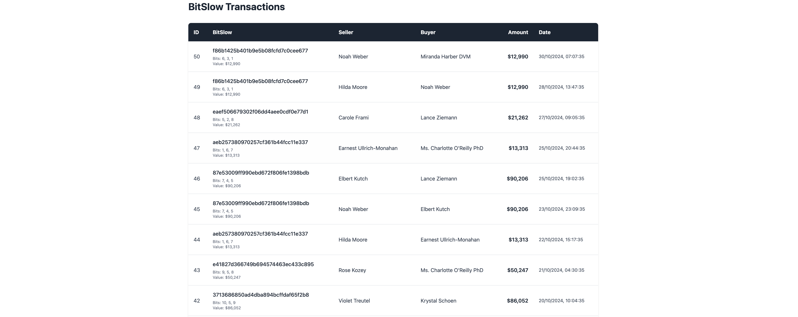

# ThemIsle Internship Test

Welcome! This test consists of a series of practical tasks designed to evaluate your skills and familiarity with web applications.

## Evaluation Criteria

The following criteria will be assessed:

- **Code Abstraction** – The quality of function and variable names, modularity, and overall code organization.
- **Database Management** – Efficiency in handling queries, caching, and data operations.
- **User Interface (UI) & User Experience (UX)** – Ease of interaction, readability, and overall intuitiveness of the interface.
- **Performance** – Speed and efficiency in loading and processing data.

## Implementation Guidelines

You have complete freedom in how you approach the task. Feel free to install any libraries that you find useful.

### Additional Notes

- You are encouraged to use **AI tools** to assist in solving the task. However, you should be able to justify your choices and fully understand the decisions made in the application.
- This project is built using **Bun** for ease of use and quick setup. (We recommend using the structure of the Single Page Application (SPA))
- For UI design, you are free to choose any style that best suits this type of application. Our main focus is on the solutions you implement to enhance user interaction and experience. **Animations are great, but use them in moderation**.
- The **database schema** can be modified as needed (and some task might need it). If you make any changes that is non-obvious, please attach a **comment explaining the reason** for the modification (e.g., improving ease of use, performance optimization, caching efficiency, etc.). Make sure that the function `seedDatabase` is up to date with your new schema.
- You can use other SQL databases to connect. Database creation and schema definitions must be still done by code by changing the function `seedDatabase`.
- When implementing new **API endpoints**, ensure **robust error handling** that properly communicates with the UI.
- When designing the UI, **make it responsive**. Consider the experience of users on **mobile devices and tablets**.
- Test with different scenarios using the `seedDatabase` function. Check if you can handle `1000` transactions. **By default the SQLite database is created in memory, you might need to change it if your machine can not handle it**.
- Use the analysis provided by the `bun run lint` to improve your codebase with best practices.
- You can share your experience in the [Feedback](./FEEDBACK.md) file. Examples:
  - What was the most challenging part?
  - Which aspects of the application did you enjoy implementing?
  - Any suggestions for improvement?

### Submitting the solution

After completing the task, please add screenshots of the application to the `screenshots` folder. You can also add videos.

Make sure your code if formatted using `bun run format` (more about it down below).

We recommend posting your solution on a Git platform (GitHub preferred) and sending us the repository link. If you want to add videos but the platform doesn't allow them due to size limits, you can use any video platform and include the links in the `FEEDBACK.md` file.

Good luck! 🚀

## Story (Introduction)

Alberto Rodrigo was a proud inventor of BitSlow, a quirky digital currency favored by an exclusive club in the vibrant heart of Barcelona. Though his app was straightforward, Alberto's users were often left frustrated by their experience.

They frequently complained about unbearably long loading times, excessive memory usage that repeatedly crashed their browsers, a glaring absence of transaction filters, and a perplexing process of adding transactions—one that involved personally emailing Alberto each time.

Despite being well aware of these shortcomings, Alberto found himself content with how things were running, especially given the remarkable profits the app generated.

One sunny afternoon, while indulging his success at the Porsche store, Alberto's phone buzzed frantically with a news alert. His heart skipped a beat as he read that BitSlow had caught the eye of international media. Almost immediately, a wave of enthusiastic emails from potential customers flooded his inbox. Filled with confidence and excitement, Alberto even considered heading straight to the Ferrari dealership.

However, his joy was abruptly shattered by another alert. His hands began to tremble, sweat streaming down his forehead as he read the alarming news: a group of talented dropouts from Harvard, Stanford, and MIT had secured a staggering $50 million from heavyweight investors like gCombinator and s9t. Their ambitious mission? Transform BitSlow into a global currency supported by the largest trading platform ever built.

Panic surged through Alberto. The sudden realization that his cherished business could become obsolete overnight struck him hard. Determined, he rushed home, feverishly attempting to upgrade his outdated app, desperately hoping his loyal users wouldn't desert him immediately.

Yet, Alberto faced a daunting obstacle—he was hopelessly out of touch with current technology. His app had run almost effortlessly for 15 long years, requiring minimal attention. Feeling overwhelmed by the latest tech jargon and trends, Alberto stumbled upon communities buzzing about "vibe coding" and powerful AI tools that made his simple methods seem prehistoric.

Brimming with hopeful enthusiasm, Alberto dove headfirst into this world of "vibe coding." But after a week of relentless trial and error, his app fell apart, suffocating under an avalanche of unfamiliar libraries and frameworks. Lost in a sea of confusing terminology—shadcn, vite, useEffect, end-to-end tests, smoke tests, web components, NoSQL databases, AI agents—Alberto felt defeated. Frustrated and bewildered, he wondered aloud, "Why all this complexity when I built everything with a humble $2 VPS and Notepad++ from a cozy coffee shop?"

In that humbling moment, Alberto understood he couldn't do it alone. He urgently needed someone well-versed in modern technology—someone who could help him reclaim the future he once saw clearly.

#### What is a BitSlow?

A BitSlow is a hash generate using Alberto's secret formula. You take 3 random numbers from range 1 to 10 and combine using a special combination then feed it to `md5` hash function. With this formula, Alberto can generated up to 1000 BitSlows.

### Tasks



Alberto has outlined the following clear requirements to modernize and enhance the usability of the BitSlow application:

#### User Registration (Sign-Up Page)

- Develop a secure and intuitive sign-up page.
- Allows new users to easily register.
- Add password support.

#### User Authentication (Login Page)

- Implement a secure and straightforward login page.
- After login, the user will have access to a profile page where they can see:
  - Total number of transactions associated with their account.
  - Total amount of BitSlow currency they currently own.
  - Total amount of BitSlow monetary value they currently own.

#### Transaction Dashboard Enhancements

- Create a user-friendly transaction dashboard.
- Introduce pagination:
  - Have a selector for 15, 30, 50 transactions per page.
  - Easy navigation across multiple pages (e.g., pages 50, 49...2, 1).
- Enable users to filter transactions by:
  - **Date range** (specific start and end dates).
  - **BitSlow currency value range**.
  - **Buyer name**.
  - **Seller name**.

#### User Experience

- Improve the loading speed of the transaction dashboard.
- Implement visual elements that notify users when an error occurs.
- (Challenge) Live Refresh the transitions dashboard when a new transaction is created.

#### Buy BitSlows

Create a dashboard where all available BitSlows are displayed (with pagination of 30 items per page). Each list item should display:

- The BitSlow hash
- Its component numbers
- Its monetary value
- The current owner (if one exists)
- A Buy button (if the user doesn't already own it)

When a user presses Buy, a new transaction will be registered and ownership of the coin will transfer.

The dashboard should also include a `Generate Coin` button. When pressed, the user will be prompted to enter an amount (this can be displayed via a modal, new page, or inline elements).

To generate a BitSlow, the system should find 3 random numbers whose combination must be unique (do not create a BitSlow with component numbers that already exist in another coin). If no more unique BitSlows can be generated, the `Generate Coin` button should be hidden.

### Working with Bun

To install dependencies:

```bash
bun install
```

To start a development server:

```bash
bun dev
```

To run for production:

```bash
bun start
```

To run tests:

```bash
bun test
```

To run format the code:

```bash
bun run format
```

To check for possible errors:

```bash
bun run lint
```
